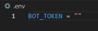
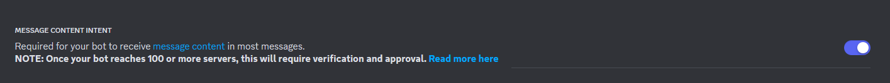
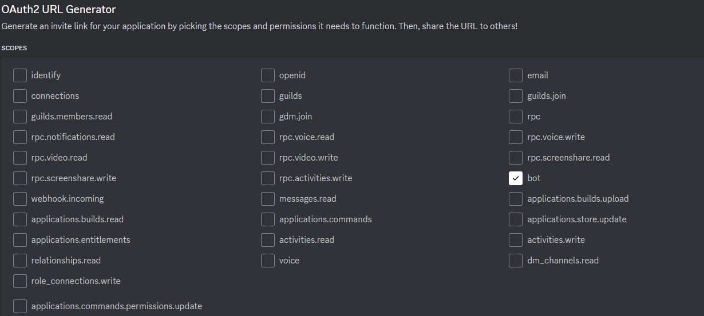
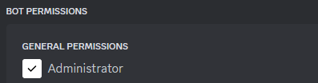
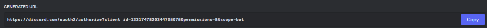

# Server manager Discord Bot

# Setup
## Prerequisites
* **Python 3.9 or later**
* **discord.py 2.3.0 or later**
* **python-dotenv 1.0**

## Step 1: Create a Discord bot

1. Go to https://discord.com/developers/applications create an application
2. Build a Discord bot under the application
3. Get the token from bot setting

4. Store the token to `.env` under the `DISCORD_BOT_TOKEN`

5. Turn MESSAGE CONTENT INTENT `ON`

6. Invite your bot to your server via OAuth2 URL Generator

  Use this link to invite your bot to the server:

## Step 2: Run the bot on the desktop

1. Open a terminal or command prompt

2. Navigate to the directory where you put your manager_bot.py file

3. Run `python3 manager_bot.py` or `python manager_bot.py` to run the bot

## Commands

1. help          Shows this message
2. close_ticket  Close your ticket. Usage: !close_ticket
3. create_ticket Creates a new ticket. Usage: !create_ticket [reason]
4. endpoll       End your poll. Usage: !endpoll [message id of the poll]
5. hello         Says hello to the user.
6. help          Shows this message
7. poll          Creates a new Poll with limit of 10 vote options. Usage: !poll [option 1] [option 2] [option ...] [option 10] [Title of the poll]
8. remind        Create a reminder for you. Usage: !remind [time] [minutes/hours] [message] 
9. stopremind    Stop the reminder. Usage: !stopremind [message] 
10. verify        Open verify box to verify. Usage: !verify
